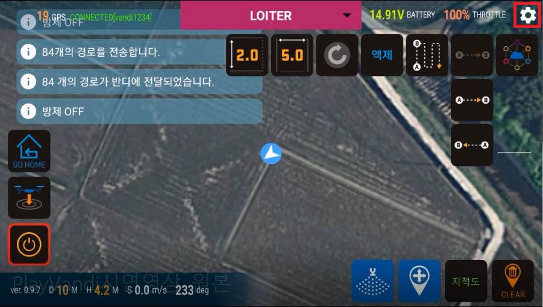
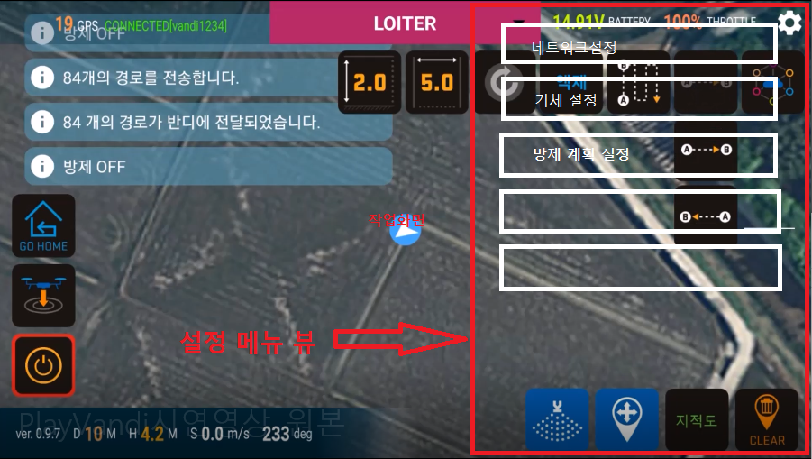
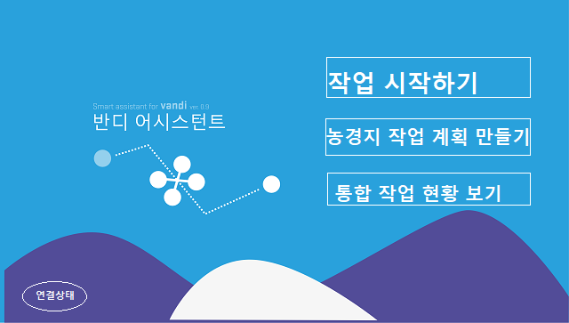

# 플레이반디 차기 작업 기획
  
## Menus
### 메뉴 구성 개선
* 진입 화면에서 네트워크 선택 버튼들 없애기 (핫스팟 네트워크 기본 연결)  
* 진입 화면에서 기체가 연결되어 있는지 여부 간단한 아이콘으로 표시
* 버튼 아이콘 일관성 개선 (디자인)
* 작업화면에서 자주 사용하는 버튼(AB방제, 턴어시스트, 분사권한, 맵잠금, 지적도, 클리어)들을 제외한 중간고도, 이륙고도, 방제폭, 액제선택 버튼, 맨 오른쪽 버튼그룹과 GPX 경로 보기 버튼들은 따로 설정메뉴 뷰로 빼기
* 작업화면에서 설정메뉴 버튼을 눌렀을 때 화면 오른쪽에서 메뉴 화면 나옴 

    설정메뉴버튼  
      
    
    설정메뉴 view  
      

  
## New Features
### 새롭게 추가되는 기능
1. 사용자 관리 : 앱 진입 화면에서 작업 시작시 [회원 인증 로그인](회원인증로그인.md) 필요  
1. [통합 작업 현황 보기](통합작업현황보기.md) {if(명칭==애매) then 새로정의}
1. 농경지 작업 계획 경로 만들기 : AB 자동방제와 달리 기체의 시동 여부와 상관없이 작업하고자 하는 농지의 다각형 방제 경로를 맵에서 직접 생성하기
    
#### [다각형 방제경로 생성 프로세스](농경지작업계획만들기.md)

  
## Buttons
### 앱 진입 화면 버튼
  
* 작업 시작하기 - 맵이 보이는 작업 화면으로 넘어감  
* 농경지 작업 계획 만들기 - 기체 시동 여부와 상관없이 다각형 방제 경로 생성 프로세스 시작  
* [통합 작업 현황 보기](통합작업현황보기.md)

### 작업 화면에 보이는 버튼 (목록에서 빠진 버튼은 설정 메뉴 뷰 안으로)
* AB 방제 버튼
* 턴어시스트 버튼
* [설정메뉴 버튼](설정메뉴.md)
* 기체시동버튼
* 분사권 제어 버튼
* 맵잠금 버튼
* 지적도보기 버튼
* 맵 클리어 버튼
* 선택 : 농경지 작업 계획 만들기 (중요하고 자주 쓸 것 같지만 앱 진입 화면에만 있는게 낳다고 생각됨)

  
## Functions
### 자동방제
* 기존 AB 방제는 그대로 두고 방제 경로 회전하기 기능만 다각형 방제경로 생성시 경로 회전하는 방식으로 대체
* [다각형 방제경로 생성](농경지작업계획만들기.md) 기능 추가

### 비행이력 관리
* 저장정보
    - 사용자 기기 정보
        - 사용자 계정
        - 단말기 전화번호 또는 아이디
        - 기체 고유 번호
    - 이륙시간
    - 착륙시간
    - 실비행 좌표, 고도 데이터
    - 비행한 위치 주소

* 개인정보보호에 문제가 된다면 room에 무조건 저장하고, 사용자 요청시 서버와 동기화 하는 방법 선택

### [사용자 정의 및 관리](회원인증로그인.md)

  
## 기타 아이디어
* 오늘의 얼리버드
* 야간방제 랭킹
* 안전 운전 방어율 랭킹
* 하루에 가장 넓은 면적을 방제 순위
* 단일 농경지 방제 계획 경로 중 가장 넓은 방제 경로 생성 -> 방제 완료 순위
* 연말에 신라호텔에서 우수 방제단 시상식 및 우수 방제작업자 표창
* 인공지능에 의한 자동 방제 지역 분배 및 기체 할당
* 인공지능에 의한 자동 지적도 맞춤 방제경로 생성 기능
