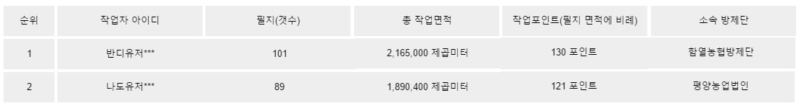

## 통합 작업 현황 보기

* 사용자별 작업포인트 순으로 랭킹 리스트 보여줌  
* 농경지 계획 경로 생성 후 서버에 등록하면 포인트 부여
* 생성한 농경지 계획 경로든, AB 방제든 작업을 시작하면 포인트 부여
* 작업을 완료한 경우 추가 포인트 부여

#### 통합 작업 현황 리스트 뷰 예시
  

> ** 추후 반디 전국 작업 현황 등 기능 추가시 사용자 편의성 증대 기대  
통합작업현황 - 반디 작업 현황  
통합작업현황 - 작업자 랭킹  
등으로 메뉴 세분화

[Home](vandi_planning.md)
